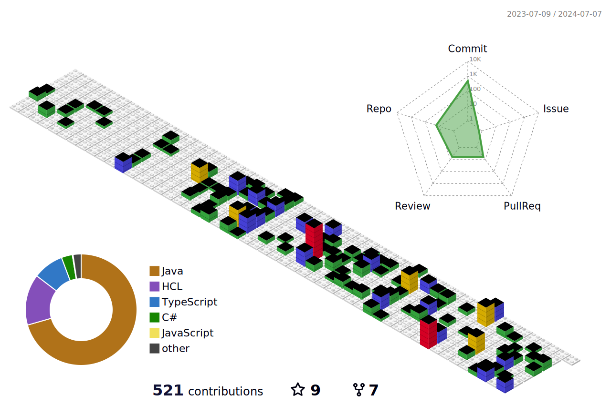

   

##

  
     
   
   

|  |  |
| :-: | :-: | 

|  |  |  |
| :-: | :-: | :-: | 

##

 

  

##

<h3> My Stacks </h3>

  <a href="https://java.com" target="_blank"><a href="https://java.com/" target="_blank">
  <a href="https://spring.io/" target="_blank">
  <a href="https://www.javascript.com/" target="_blank">
  <a href="https://www.typescriptlang.org/" target="_blank">
  <a href="https://html.com/" target="_blank">
  <a href="https://www.w3.org/Style/CSS/Overview.en.html" target="_blank">
   <a href="https://nodejs.org/en/" target="_blank">
  <a href="https://www.npmjs.com/" target="_blank">
  <a href="https://reactjs.org/" target="_blank">
    <a href="https://vuejs.org/" target="_blank">
  <a href="https://angular.io/" target="_blank">
  <a href="https://www.apache.org/" target="_blank">
  <a href="https://www.confluent.io/lp/apache-kafka" target="_blank">
  <a href="https://docs.microsoft.com/en-us/dotnet/csharp/" target="_blank">
  <a href="https://www.docker.com/" target="_blank">
  <a href="https://git-scm.com/" target="_blank">
  <a href="https://github.com/" target="_blank">
  <a href="https://about.gitlab.com/" target="_blank">
  <a href="https://id.heroku.com/login" target="_blank">
  <a href="https://www.jetbrains.com/idea/" target="_blank">
  <a href="https://www.jenkins.io/" target="_blank">
  <a href="https://azure.microsoft.com/en-us/" target="_blank">
  <a href="https://www.atlassian.com/br/software/jira" target="_blank">
  <a href="https://cloud.google.com/learn/what-is-kubernetes" target="_blank">
  <a href="https://www.mongodb.com/" target="_blank">
  <a href="https://www.mysql.com/" target="_blank">
  <a href="https://www.oracle.com/" target="_blank">
  <a href="https://www.php.net/" target="_blank">
  <a href="https://www.postgresql.org/" target="_blank">
  <a href="https://www.microsoft.com/en-us/sql-server/sql-server-downloads" target="_blank">
  <a href="https://tortoisesvn.net/" target="_blank">
  <a href="https://tomcat.apache.org/" target="_blank">

##
     

<h3> My Contacts </h3>

  
  
  
   

##

   </a>

##

<picture>
  <source media="(prefers-color-scheme: dark)" srcset="https://raw.githubusercontent.com/wolwerr/wolwerr/output/github-contribution-grid-snake-dark.svg">
  <source media="(prefers-color-scheme: light)" srcset="https://raw.githubusercontent.com/wolwerr/wolwerr/output/github-contribution-grid-snake.svg">
  
</picture>

##  GitHub Trophies
     

##

     
##

  <a href="https://github.com/wolwerr/" target="_blank">

 
 
##  

